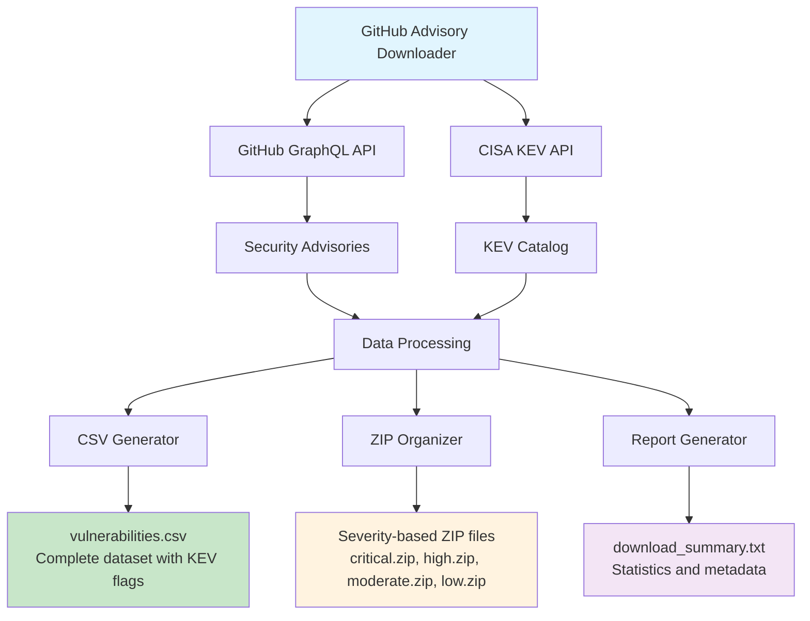

# GitHub Security Advisory Downloader

**📋 README.md | Version 2.0.0**

A comprehensive Python tool for downloading, organizing, and analyzing security vulnerabilities from GitHub's Advisory Database with CISA KEV (Known Exploited Vulnerabilities) integration.

> **⚠️ Version 2.0.0 Notice**: This version introduces a modular architecture with breaking changes. See [IMPROVEMENTS.md](IMPROVEMENTS.md) for migration details from v1.0.0.

## 🎯 Overview

This tool automatically downloads all security advisories from GitHub's Advisory Database, cross-references them with CISA's Known Exploited Vulnerabilities catalog, and organizes the data into multiple formats for analysis and research.

### What's New in v2.0.0

- 🏗️ **Modular Architecture**: Split into 9 focused modules for better maintainability
- 📦 **Package Installation**: Now installable via pip with console script entry point
- 🎨 **Multiple Output Formats**: CSV, JSON, JSONL, and summary reports
- ✅ **Comprehensive Testing**: Full pytest suite with 70+ tests
- 🔍 **Data Validation**: Input/output validation for data quality
- 💾 **Smart Caching**: CISA KEV catalog caching with TTL
- 🎯 **Enhanced CLI**: 12+ command-line options for customization
- 🔐 **Security Improvements**: Better token handling and input sanitization
- 🚀 **CI/CD Pipeline**: GitHub Actions with multi-version testing

## 📊 Architecture Diagram



## ✨ Features

### Core Functionality
- **Complete Data Collection**: Downloads all GitHub security advisories via GraphQL API
- **KEV Integration**: Cross-references CVEs with CISA's Known Exploited Vulnerabilities catalog
- **Multiple Output Formats**: CSV, JSON, JSONL, and summary reports
- **Comprehensive Metadata**: CVSS scores, affected packages, version ranges, references
- **Smart Caching**: Local CISA KEV cache with configurable TTL (default: 1 hour)

### Quality & Reliability
- **Data Validation**: Validates CVE IDs, GHSA IDs, CVSS scores, and timestamps
- **Type Safety**: Full type hints throughout the codebase
- **Error Handling**: Custom exceptions with graceful error recovery
- **Logging System**: Structured logging with configurable levels
- **Progress Tracking**: Visual progress bars (with optional rich library)

### Configuration & Deployment
- **Flexible Configuration**: Environment variables via `.env` file support
- **CLI Options**: 12+ command-line arguments for customization
- **Installable Package**: Install via pip with `github-advisory-downloader` command
- **Docker Support**: Included Dockerfile for containerized deployment
- **CI/CD Ready**: GitHub Actions workflow with comprehensive testing

## 🚀 Quick Start

### Prerequisites

- Python 3.8+ (tested on 3.8, 3.9, 3.10, 3.11, 3.12)
- pip package manager

### Installation

#### Option 1: Install from source
```bash
# Clone the repository
git clone https://github.com/jblo/Github-Advisory-Downloader
cd Github-Advisory-Downloader

# Install the package
pip install -e .
```

#### Option 2: Development setup
```bash
# Clone and install with dev dependencies
git clone https://github.com/jblo/Github-Advisory-Downloader
cd Github-Advisory-Downloader

# Install dependencies
pip install -r requirements.txt

# Run directly via module
python -m github_advisory_downloader.cli
```

### Basic Usage

#### Using the installed command (Option 1)
```bash
# Basic usage (requires GitHub token)
github-advisory-downloader --token YOUR_GITHUB_TOKEN

# Using environment variable (recommended)
export GITHUB_TOKEN="your_token_here"
github-advisory-downloader

# Custom output directory and format
github-advisory-downloader --output custom_dir --format csv json

# Filter by severity
github-advisory-downloader --filter CRITICAL HIGH

# Dry run to preview
github-advisory-downloader --dry-run
```

#### Using Python module (Option 2)
```bash
# Basic usage
python -m github_advisory_downloader.cli --token YOUR_GITHUB_TOKEN

# With environment variable
export GITHUB_TOKEN="your_token_here"
python -m github_advisory_downloader.cli
```

### GitHub Token Setup (Required)

⚠️ **Important**: A GitHub token is required to avoid rate limiting.

1. Go to GitHub Settings → Developer settings → [Personal access tokens](https://github.com/settings/tokens)
2. Generate a new token (classic)
3. **No scopes needed** for public advisory data
4. Set as environment variable:

```bash
# Linux/Mac
export GITHUB_TOKEN="ghp_your_token_here"

# Or use .env file (recommended)
cp .env.example .env
# Edit .env and add your token
```

## 📁 Output Structure

### Default Output (CSV + Summary)
```
github_advisories/
├── vulnerabilities_YYYYMMDD_HHMMSS.csv   # Complete vulnerability dataset
└── download_summary_YYYYMMDD_HHMMSS.txt  # Statistics and metadata
```

### With JSON Output (`--format json`)
```
github_advisories/
├── vulnerabilities.csv
├── critical.json         # Critical severity advisories
├── high.json            # High severity advisories
├── moderate.json        # Moderate severity advisories
├── low.json             # Low severity advisories
└── download_summary.txt
```

### With JSONL Output (`--format jsonl`)
```
github_advisories/
├── vulnerabilities.csv
├── advisories.jsonl      # All advisories in JSON Lines format
└── download_summary.txt
```

## 📊 CSV Data Schema

The generated `vulnerabilities.csv` contains the following columns:

| Column | Description | Example |
|--------|-------------|---------|
| `ghsa_id` | GitHub Security Advisory ID | GHSA-xxxx-xxxx-xxxx |
| `cve_ids` | Associated CVE identifiers | CVE-2023-1234, CVE-2023-5678 |
| `summary` | Brief vulnerability description | Remote code execution in package X |
| `severity` | Risk level | CRITICAL, HIGH, MODERATE, LOW |
| `cvss_score` | CVSS numerical score | 9.8 |
| `cvss_vector` | CVSS vector string | CVSS:3.1/AV:N/AC:L/PR:N/UI:N/S:U/C:H/I:H/A:H |
| `package_name` | Affected package | lodash |
| `ecosystem` | Package ecosystem | npm, PyPI, Maven, etc. |
| `vulnerable_version_range` | Affected versions | < 4.17.21 |
| `first_patched_version` | First safe version | 4.17.21 |
| `published_at` | Publication timestamp | 2023-01-15T10:30:00Z |
| `updated_at` | Last update timestamp | 2023-01-16T14:22:00Z |
| `references` | Reference URLs | https://example.com/advisory |
| `permalink` | GitHub advisory URL | https://github.com/advisories/GHSA-... |
| **`KEV`** | **CISA KEV flag** | **"1" if exploited, empty otherwise** |

## 🔍 Usage Examples

### Data Analysis with Pandas

```python
import pandas as pd

# Load the vulnerability data
df = pd.read_csv('github_advisories/vulnerabilities.csv')

# Find all known exploited vulnerabilities
kev_vulns = df[df['KEV'] == '1']
print(f"Found {len(kev_vulns)} known exploited vulnerabilities")

# Analyze by severity
severity_counts = df['severity'].value_counts()
print("Vulnerabilities by severity:")
print(severity_counts)

# Top affected ecosystems
ecosystem_counts = df['ecosystem'].value_counts().head(10)
print("Most affected ecosystems:")
print(ecosystem_counts)
```

### Filtering Critical KEV Vulnerabilities

```python
# Find critical vulnerabilities that are actively exploited
critical_kev = df[(df['severity'] == 'CRITICAL') & (df['KEV'] == '1')]
print(f"Critical KEV vulnerabilities: {len(critical_kev)}")

# Export for immediate attention
critical_kev.to_csv('immediate_action_required.csv', index=False)
```

## 🧪 Testing

The project includes a comprehensive test suite with 70+ tests:

```bash
# Run all tests
pytest tests/ -v

# Run with coverage
pytest tests/ -v --cov=github_advisory_downloader --cov-report=html

# Run specific test modules
pytest tests/test_validation.py -v         # Validation tests
pytest tests/test_data_processing.py -v    # Data processing tests
pytest tests/test_output.py -v             # Output generation tests
```

### Test Coverage

The test suite covers:
- ✅ **Data Validation**: CVE IDs, GHSA IDs, CVSS scores, timestamps
- ✅ **Advisory Processing**: Extraction, KEV matching, normalization
- ✅ **Output Generation**: CSV, JSON, JSONL formats
- ✅ **Configuration**: Environment variables, CLI arguments
- ✅ **Error Handling**: Custom exceptions, edge cases
- ✅ **Dry Run Mode**: Preview functionality without file writes

### Code Quality Tools

```bash
# Format code
black github_advisory_downloader tests

# Sort imports
isort github_advisory_downloader tests

# Lint code
flake8 github_advisory_downloader tests --max-line-length=100

# Type check
mypy github_advisory_downloader

# Security scan
bandit -r github_advisory_downloader -ll

# Install pre-commit hooks
pre-commit install
```

## 📋 Requirements

### Core Dependencies
```
requests==2.32.3       # HTTP library for API calls
python-dotenv==1.0.0   # Environment variable management
rich==13.7.0           # Progress bars and rich output (optional)
pandas==2.2.0          # Data analysis (optional)
```

### Development Dependencies
```
pytest==7.4.4          # Testing framework
pytest-cov==4.1.0      # Coverage reporting
black==24.1.1          # Code formatting
isort==5.13.2          # Import sorting
flake8==7.0.0          # Linting
mypy==1.8.0            # Type checking
bandit==1.7.5          # Security scanning
pre-commit==3.6.0      # Git hooks
```

See `requirements.txt` for the complete list with pinned versions.

## 🔧 Configuration

### Environment Variables (.env file)

Copy `.env.example` to `.env` and configure:

```bash
# GitHub API Configuration
GITHUB_TOKEN=ghp_your_token_here

# Output Configuration
OUTPUT_DIR=github_advisories
CISA_CACHE_DIR=.cache

# Behavior
DEBUG=false
DRY_RUN=false
BATCH_SIZE=100
```

### Command Line Options

```bash
usage: github-advisory-downloader [-h] [--token TOKEN] [--output OUTPUT]
                                   [--format {csv,json,jsonl} [{csv,json,jsonl} ...]]
                                   [--filter {CRITICAL,HIGH,MODERATE,LOW} [...]]
                                   [--batch-size N] [--cache-dir DIR]
                                   [--dry-run] [--debug] [--no-summary]
                                   [--timestamp | --no-timestamp]

Download and analyze GitHub Security Advisories with CISA KEV integration

optional arguments:
  -h, --help            Show this help message and exit
  --token TOKEN         GitHub personal access token (use env var instead)
  --output OUTPUT       Output directory (default: github_advisories)
  --format FORMAT       Output formats: csv, json, jsonl (default: csv)
  --filter SEVERITY     Filter by severity levels
  --batch-size N        GraphQL batch size (default: 100)
  --cache-dir DIR       Cache directory (default: .cache)
  --dry-run             Preview without writing files
  --debug               Enable debug logging
  --no-summary          Skip summary report generation
  --timestamp           Add timestamp to filenames (default)
  --no-timestamp        Use fixed filenames without timestamps
```

### Example Configurations

```bash
# Production: Filter critical/high, JSON output, no timestamps
github-advisory-downloader \
  --filter CRITICAL HIGH \
  --format csv json \
  --no-timestamp \
  --output /data/advisories

# Development: Debug mode with dry run
github-advisory-downloader \
  --debug \
  --dry-run \
  --batch-size 10

# Analysis: All formats, timestamped files
github-advisory-downloader \
  --format csv json jsonl \
  --timestamp
```

## 🤝 Contributing

1. Fork the repository
2. Create a feature branch (`git checkout -b feature/amazing-feature`)
3. Make your changes
4. Add tests for new functionality
5. Run the test suite (`python -m pytest`)
6. Commit your changes (`git commit -m 'Add amazing feature'`)
7. Push to the branch (`git push origin feature/amazing-feature`)
8. Open a Pull Request

## 📈 Performance

- **Rate Limiting**: Automatically respects GitHub's API rate limits
- **Memory Efficient**: Processes data in chunks to handle large datasets
- **Resumable**: Graceful handling of network interruptions
- **Parallel Processing**: Future enhancement for faster downloads

## 🛠️ Troubleshooting

### Common Issues

**Rate Limit Exceeded**
```
Solution: Use a GitHub personal access token with --token parameter
```

**Network Timeouts**
```
Solution: The script automatically retries failed requests with exponential backoff
```

**Large Dataset Memory Usage**
```
Solution: The script processes data in chunks to minimize memory usage
```

### Debug Mode

```bash
# Enable verbose logging
python github_advisory_downloader.py --token YOUR_TOKEN --debug
```

## 📄 License

This project is licensed under the MIT License - see the [LICENSE](LICENSE) file for details.

## 🙏 Acknowledgments

- [GitHub Advisory Database](https://github.com/advisories) for providing comprehensive security data
- [CISA KEV Catalog](https://www.cisa.gov/known-exploited-vulnerabilities-catalog) for known exploited vulnerabilities data
- The security research community for continuous vulnerability discovery and disclosure

## 📞 Support

- 🐛 Issues: [GitHub Issues](https://github.com/jblo/Github-Advisory-Downloader/issues)
- 💬 Discussions: [GitHub Discussions](https://github.com/jblo/Github-Advisory-Downloader/discussions)

---

**⚡ Pro Tip**: Combine this tool with automated security scanning in your CI/CD pipeline to stay ahead of emerging threats!
