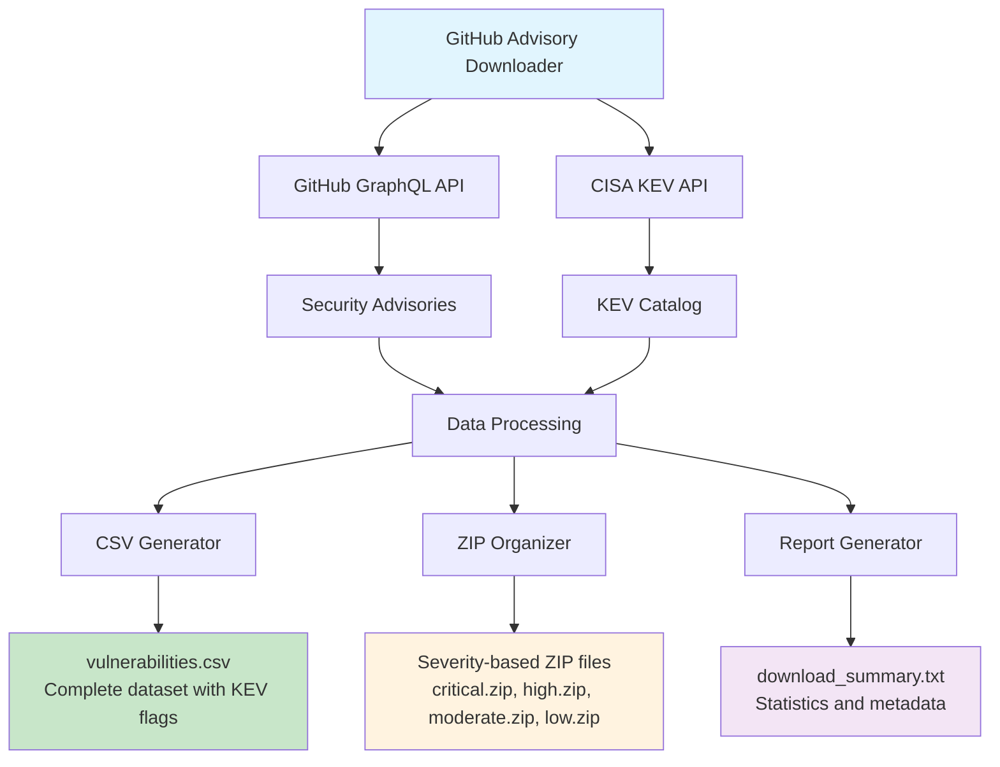

# GitHub Security Advisory Downloader

**📋 README.md**

A comprehensive Python tool for downloading, organizing, and analyzing security vulnerabilities from GitHub's Advisory Database with CISA KEV (Known Exploited Vulnerabilities) integration.

## 🎯 Overview

This tool automatically downloads all security advisories from GitHub's Advisory Database, cross-references them with CISA's Known Exploited Vulnerabilities catalog, and organizes the data into multiple formats for analysis and research.

## 📊 Architecture Diagram



## ✨ Features

- **Complete Data Collection**: Downloads all GitHub security advisories via GraphQL API
- **KEV Integration**: Cross-references CVEs with CISA's Known Exploited Vulnerabilities catalog
- **Multiple Output Formats**: CSV for analysis, JSON archives organized by severity
- **Comprehensive Metadata**: CVSS scores, affected packages, version ranges, references
- **Rate Limiting**: Respectful API usage with automatic throttling
- **Error Handling**: Robust error recovery and progress tracking
- **Flexible Configuration**: Optional GitHub token support for higher rate limits

## 🚀 Quick Start

### Prerequisites

- Python 3.7+
- `requests` library

### Installation

```bash
# Clone or download the package
git clone <repository-url>
cd github-advisory-downloader

# Install dependencies
pip install -r requirements.txt
```

### Basic Usage

```bash
# Basic usage (no authentication)
python github_advisory_downloader.py

# With GitHub token for higher rate limits
python github_advisory_downloader.py --token YOUR_GITHUB_TOKEN

# Custom output directory
python github_advisory_downloader.py --output-dir custom_directory
```

### GitHub Token Setup (Optional - but not really, you'll always rate limit out without a token, so do this step.)

For higher rate limits, create a GitHub personal access token:

1. Go to GitHub Settings → Developer settings → Personal access tokens
2. Generate a new token (no special scopes needed for public data)
3. Use with `--token` parameter

## 📁 Output Structure

```
github_advisories/
├── vulnerabilities.csv      # Complete vulnerability dataset
├── critical.zip            # Critical severity advisories (JSON)
├── high.zip               # High severity advisories (JSON)
├── moderate.zip           # Moderate severity advisories (JSON)
├── low.zip               # Low severity advisories (JSON)
└── download_summary.txt   # Statistics and metadata
```

## 📊 CSV Data Schema

The generated `vulnerabilities.csv` contains the following columns:

| Column | Description | Example |
|--------|-------------|---------|
| `ghsa_id` | GitHub Security Advisory ID | GHSA-xxxx-xxxx-xxxx |
| `cve_ids` | Associated CVE identifiers | CVE-2023-1234, CVE-2023-5678 |
| `summary` | Brief vulnerability description | Remote code execution in package X |
| `severity` | Risk level | CRITICAL, HIGH, MODERATE, LOW |
| `cvss_score` | CVSS numerical score | 9.8 |
| `cvss_vector` | CVSS vector string | CVSS:3.1/AV:N/AC:L/PR:N/UI:N/S:U/C:H/I:H/A:H |
| `package_name` | Affected package | lodash |
| `ecosystem` | Package ecosystem | npm, PyPI, Maven, etc. |
| `vulnerable_version_range` | Affected versions | < 4.17.21 |
| `first_patched_version` | First safe version | 4.17.21 |
| `published_at` | Publication timestamp | 2023-01-15T10:30:00Z |
| `updated_at` | Last update timestamp | 2023-01-16T14:22:00Z |
| `references` | Reference URLs | https://example.com/advisory |
| `permalink` | GitHub advisory URL | https://github.com/advisories/GHSA-... |
| **`KEV`** | **CISA KEV flag** | **"1" if exploited, empty otherwise** |

## 🔍 Usage Examples

### Data Analysis with Pandas

```python
import pandas as pd

# Load the vulnerability data
df = pd.read_csv('github_advisories/vulnerabilities.csv')

# Find all known exploited vulnerabilities
kev_vulns = df[df['KEV'] == '1']
print(f"Found {len(kev_vulns)} known exploited vulnerabilities")

# Analyze by severity
severity_counts = df['severity'].value_counts()
print("Vulnerabilities by severity:")
print(severity_counts)

# Top affected ecosystems
ecosystem_counts = df['ecosystem'].value_counts().head(10)
print("Most affected ecosystems:")
print(ecosystem_counts)
```

### Filtering Critical KEV Vulnerabilities

```python
# Find critical vulnerabilities that are actively exploited
critical_kev = df[(df['severity'] == 'CRITICAL') & (df['KEV'] == '1')]
print(f"Critical KEV vulnerabilities: {len(critical_kev)}")

# Export for immediate attention
critical_kev.to_csv('immediate_action_required.csv', index=False)
```

## 🧪 Testing

Run the test suite to ensure everything works correctly:

```bash
# Run all tests
python -m pytest tests/ -v

# Run specific test categories
python -m pytest tests/test_api_integration.py -v    # API tests
python -m pytest tests/test_data_processing.py -v   # Data processing tests
python -m pytest tests/test_csv_generation.py -v    # CSV generation tests
```

### Test Coverage

The test suite covers:
- ✅ GitHub API integration
- ✅ CISA KEV catalog fetching
- ✅ Data processing and validation
- ✅ CSV generation and schema validation
- ✅ ZIP file creation and organization
- ✅ Error handling and edge cases

## 📋 Requirements

`requirements.txt`:

```
requests>=2.31.0
pytest>=7.4.0
pytest-cov>=4.1.0
```

## 🔧 Configuration

### Environment Variables

```bash
# Optional: Set GitHub token via environment variable
export GITHUB_TOKEN="your_token_here"
python github_advisory_downloader.py
```

### Command Line Options

```
usage: github_advisory_downloader.py [-h] [--token TOKEN] [--output-dir OUTPUT_DIR]

Download GitHub Security Advisories organized by severity

optional arguments:
  -h, --help            show this help message and exit
  --token TOKEN         GitHub personal access token (optional, for higher rate limits)
  --output-dir OUTPUT_DIR
                        Output directory (default: github_advisories)
```

## 🤝 Contributing

1. Fork the repository
2. Create a feature branch (`git checkout -b feature/amazing-feature`)
3. Make your changes
4. Add tests for new functionality
5. Run the test suite (`python -m pytest`)
6. Commit your changes (`git commit -m 'Add amazing feature'`)
7. Push to the branch (`git push origin feature/amazing-feature`)
8. Open a Pull Request

## 📈 Performance

- **Rate Limiting**: Automatically respects GitHub's API rate limits
- **Memory Efficient**: Processes data in chunks to handle large datasets
- **Resumable**: Graceful handling of network interruptions
- **Parallel Processing**: Future enhancement for faster downloads

## 🛠️ Troubleshooting

### Common Issues

**Rate Limit Exceeded**
```
Solution: Use a GitHub personal access token with --token parameter
```

**Network Timeouts**
```
Solution: The script automatically retries failed requests with exponential backoff
```

**Large Dataset Memory Usage**
```
Solution: The script processes data in chunks to minimize memory usage
```

### Debug Mode

```bash
# Enable verbose logging
python github_advisory_downloader.py --token YOUR_TOKEN --debug
```

## 📄 License

This project is licensed under the MIT License - see the [LICENSE](LICENSE) file for details.

## 🙏 Acknowledgments

- [GitHub Advisory Database](https://github.com/advisories) for providing comprehensive security data
- [CISA KEV Catalog](https://www.cisa.gov/known-exploited-vulnerabilities-catalog) for known exploited vulnerabilities data
- The security research community for continuous vulnerability discovery and disclosure

## 📞 Support

- 🐛 Issues: [GitHub Issues](https://github.com/jblo/Github-Advisory-Downloader/issues)
- 💬 Discussions: [GitHub Discussions](https://github.com/jblo/Github-Advisory-Downloader/discussions)

---

**⚡ Pro Tip**: Combine this tool with automated security scanning in your CI/CD pipeline to stay ahead of emerging threats!
